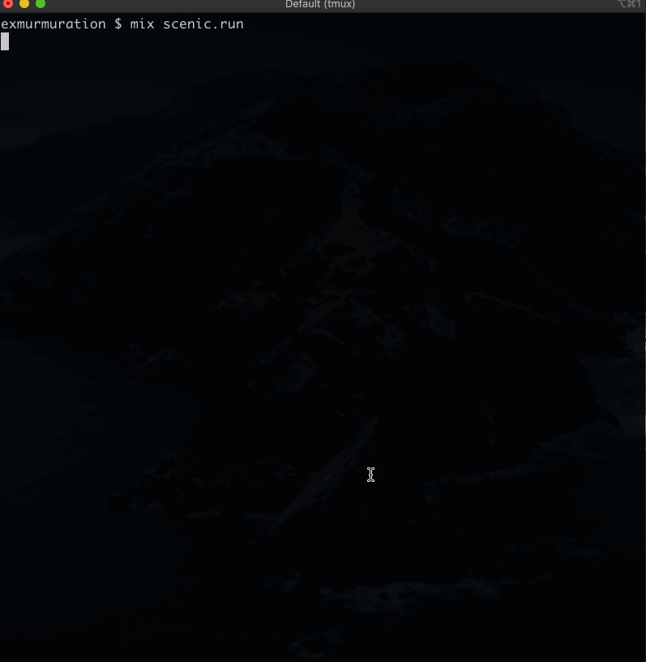

# Running
`mix scenic.run`

### Install Elixir
```
parthpatel@Parths-MacBook-Pro exmurmuration $ elixir --version
Erlang/OTP 21 [erts-10.3.1] [source] [64-bit] [smp:4:4] [ds:4:4:10] [async-threads:1] [hipe] [dtrace]

Elixir 1.8.1 (compiled with Erlang/OTP 21)
parthpatel@Parths-MacBook-Pro exmurmuration $
```
## Install scenic
* Install dependencies from [here](https://github.com/boydm/scenic_new#installing-on-macos)
* `mix archive.install hex scenic_new` # TODO - might not need these bec of deps.get
* `mix deps.get`


